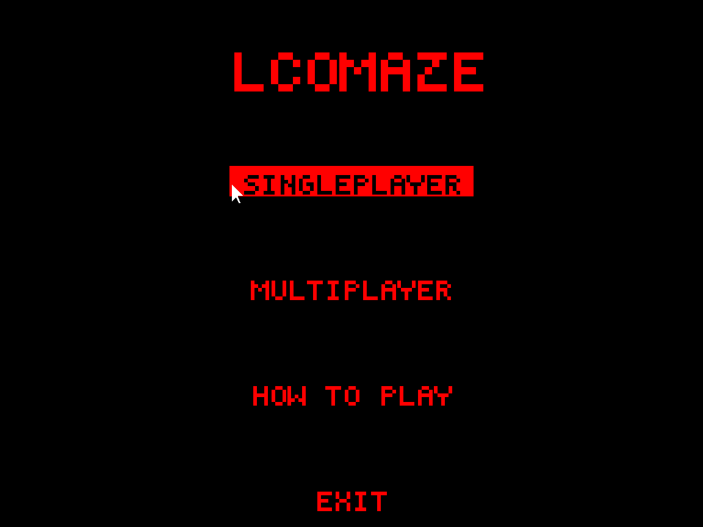

# LCOMaze

This maze game was developed as part of the LCOM course, utilizing low-level C programming on the MINIX operating system. It offers single-player and multiplayer modes, challenging players to navigate intricate labyrinths as quickly as possible.
Designed to run on MINIX, this project provides valuable insights into operating system concepts and low-level programming.

Group members:

- Henrique Fernandes (up202204988@up.pt)
- José Sousa (up202208817@up.pt)
- Luís Cordeiro (up202205425@up.pt)
- Miguel Cabral (up202204996@up.pt)

Final Grade: 19.96 / 20

# [Demo Video](https://www.youtube.com/watch?v=PioAfe_U2j4)

# Table of Contents

- [LCOMaze](#lcomaze)
- [Table of Contents](#table-of-contents)
- [Instructions](#instructions)
  - [Compile \& Run](#compile--run)
  - [Menu](#menu)
  - [Controls](#controls)
  - [Singleplayer Mode](#singleplayer-mode)
  - [Multiplayer Mode](#multiplayer-mode)
  - [Screen with Instructions](#screen-with-instructions)
- [Project Status](#project-status)
  - [Timer](#timer)
  - [Keyboard \& Mouse](#keyboard--mouse)
  - [Video Card](#video-card)
  - [Serial Port](#serial-port)
  - [Real Time Clock](#real-time-clock)
- [Code Organization and Implementation](#code-organization-and-implementation)
  - [Data Structures](#data-structures)
    - [Stack](#stack)
    - [Linked List](#linked-list)
    - [Queue](#queue)
  - [Game Logic](#game-logic)
    - [Initialization](#initialization)
    - [Game Loop](#game-loop)
    - [Keyboard and Mouse Handling](#keyboard-and-mouse-handling)
    - [Flashlight](#flashlight)
    - [Multiplayer Implementation](#multiplayer-implementation)
  - [The Maze](#the-maze)
    - [Data Representation](#data-representation)
    - [Maze Generation](#maze-generation)
    - [Algorithm to Solve the Maze](#algorithm-to-solve-the-maze)
    - [Collision System](#collision-system)
  - [Menu](#menu-1)
- [Conclusion](#conclusion)

# Instructions

## Compile & Run

First, create a virtual machine running the MINIX operating system. In order to have access to the necessary functions, the version is custom made, and can be found [here](https://drive.google.com/file/d/1dM32zTzkTUEqNtTwsO-n__XO6r1Y5I-f/view). This file includes the virtual machine already made, ready to be imported to Virtual Box.  
To run the project, compile by running `make` in the source code folder. Then, just run `lcom_run proj host`. If a second user wants to play in multiplayer with the first user, the run command must be `lcom_run proj client`.

## Menu

We developed a comprehensive and user-friendly menu for our game, featuring four distinct entries to enhance the player experience:



- Singleplayer: Singleplayer game where your goal is to reach the end as soon as possible
- Multiplayer-: Multiplayer game where you and another player will compete and the one who finishes his labyrinth faster wins
- How to play: Instructions on how to move and play the game
- Exit: Exit the game

The menu can be controlled using the mouse to select and click on each button.

## Controls

The player can move in four directions: forward, backward, left, and right by using <kbd>WASD</kbd>. Rotation is determined by a trigonometric relationship between the player's position and the mouse's position, enhancing the intuitive nature of the controls.

## Singleplayer Mode


In single-player mode, the player navigates through a simple labyrinth to reach the end in the shortest time possible. The player is surrounded by a small visible circle, allowing them to see a fraction of the environment. Movement and rotation are controlled using the mouse and keyboard, providing a smooth and intuitive experience.  
Once the player reaches the end of the labyrinth, the screen displays the elapsed time, calculated as the difference between the start and finish times.

## Multiplayer Mode

To make the game more fun and competitive, we developed a multiplayer mode.  
In this mode, two players compete to see who finishes the maze first. There is also some luck involved because the labyrinths are randomized, thus, to win, a player not only needs to be fast but also be lucky to get an easy maze.

## Screen with Instructions

Intended for new players, the How to Play screen provides instructions about the controls for the game:


# Project Status

| Device      | What For                                         | Method                    |
| ----------- | ------------------------------------------------ | ------------------------- |
| Timer       | Controlling the frame rate                       | Interrupts                |
| Keyboard    | Player movement                                  | Interrupts                |
| Mouse       | Menu navigation and player aim                   | Interrupts                |
| Video Card  | Display                                          | Double buffering via copy |
| Serial Port | Communications between 2 players                 | Interrupts and polling    |
| RTC         | Measuring the time between the start and the end | Interrupts                |

## Timer

The timer is a critical component used to control the frame rate of the game through the use of interrupts. By leveraging the timer, we can ensure a consistent and smooth visual experience for the player.  
We begin by subscribing to Timer 0, configuring it to operate at a frequency of 20Hz. This frequency selection translates to a fixed frame rate of 20 frames per second (fps), which provides a balance between performance and visual smoothness.
Each interrupt generated by the timer at this frequency triggers an update to the user interface. This systematic triggering ensures that the display is refreshed at regular intervals, providing a fluid and consistent visual output.  
The timer is handled in the `prog.c` file.  
The specifics of how each interrupt leads to a UI update are detailed [here](#game-loop).

## Keyboard & Mouse

The keyboard and the mouse are integral tools for player movement within the game. These input devices allow the player to interact with the game environment intuitively and responsively. Similar to the timer, we utilize interrupts to handle inputs from the keyboard and mouse.

[This section](#keyboard-and-mouse-handling) is dedicated to explaining the process that occurs when there is an interrupt.

## Video Card

When it comes to the video mode, we decided to use mode 14C, mainly because it uses 8 bits for each color channel in direct mode, giving a total of 16,777,216 possible colors. This color depth is also known as True Color since it covers the range the human eye can perceive. For this reason, we can use XPMs with a higher number of colors. We are also using a custom font and animated sprites, both of which are saved in the XPM format.
For drawing on the screen, we utilize the video card in combination with double buffering via copy. This technique is essential for providing a smooth and visually pleasing gaming experience by preventing screen flickering.  
Double buffering involves the use of two buffers: a primary buffer (also known as the front buffer) and a secondary buffer (or back buffer). The primary buffer is what is currently displayed on the screen, while the secondary buffer is where we perform all the drawing operations.  
The process begins with rendering the entire in the secondary buffer (the rendering process is detailed [here](#game-loop)). By performing these operations off-screen in the secondary buffer, we can ensure that the frame is fully prepared before it is displayed.  
Once the frame is complete, the contents of the secondary buffer are copied to the primary buffer in a single operation. This copy process is fast and efficient, and it ensures that the viewer sees a fully rendered frame all at once. As a result, this technique eliminates the screen flickering that would otherwise occur if the components were drawn to the main frame in real time.

## Serial Port

The Serial Port is used to connect two computers during Multiplayer mode. It operates using port 0x3f8 for communication. The project employs a polling method for sending information and interrupts for receiving information. The functionalities implemented for the Serial Port include:

- Sending Information to the Other VM: This functionality is handled by the `sp_send_int()` function, which details the process of sending data to the connected virtual machine.
- Receiving Information: This functionality is managed by the `receive()` function, which explains how the system receives data from the other machine.

These functions are present inside the `serial.c` file. More details about the way the serial port is used can be found [here](#multiplayer-implementation).

## Real Time Clock

The Real-Time Clock (RTC) is essential for accurately measuring the duration of gameplay, providing precise timekeeping, which is even more crucial for determining the winner if two users are playing multiplayer.  
The following functionalities were implemented:

- The `get_time()` function retrieves the current date and time from the RTC, allowing the game to log start and end times accurately.
- Periodic update interrupts, used with `set_update()`, `clean_update()`, `subscribe_rtc()`, `unsubscribe_rtc()` and `update()`.

These functions can be found inside the file `rtc.c`.

# Code Organization and Implementation

## Data Structures

### Stack

A stack is a data structure that follows the Last In, First Out (LIFO) principle. It allows for insertion and deletion to the top of the stack. In this project, the stack was implemented with nodes that point to the node below them:

```c
struct StackNode {
    struct Cell *cell;
    struct StackNode *next;
};

struct Stack {
    struct StackNode *stack_top;
    int size;
};
```

This stack includes methods for pushing and removing elements:

```c
void stack_push(struct Stack *stack, struct Cell *cell);
struct Cell *stack_pop(struct Stack *stack);
struct Cell *stack_top(struct Stack *stack);
```

This stack is a critical component of the maze generation algorithm, which will be mentioned later.

### Linked List

A linked list is another fundamental data structure used to store elements sequentially. Unlike arrays, linked lists provide dynamic memory management, allowing efficient insertion of elements.  
Its implementation is similar to the Stack implementation:

```c
struct ListNode {
    struct Cell *cell;
    struct ListNode *next;
};

struct LinkedList {
    struct ListNode *head;
    struct ListNode *last;
    int size;
};
```

This data structure is used in an algorithm to solve the maze, which will be explained in further sections.

### Queue

A queue is a data structure very similar to a stack, but instead of being Last In, First Out, it is First In, First Out (FIFO). It allows for insertion to the back of the queue and deletion from the front of the queue. Since we do not need a queue with a huge size, we decided to use an array-based implementation, in which there is an array and 2 variables, one representing the index of the front of the queue and the other representing the index of the back of the queue.

## Game Logic

Except for the multiplayer, every functionality described here is inside the `game.c` file.

### Initialization

Before each game, there are a couple of steps that need to be taken before playing it, such as setting the initial position of the player and generating the maze. This process is handled in the `init_game()` function.

### Game Loop

For each frame, it is necessary to update the display. To achieve this, the process involves several steps. First, we clear the screen to prepare for the new frame. Next, we copy the maze frame from a separate buffer to the secondary buffer. Following this, we draw the player and then the mouse on the maze. After drawing the necessary elements, we check if the game has ended, which occurs if the player has reached the end of the maze. Finally, we swap the buffers to display the updated frame. This process is handled in the `game_main_loop()` function.

### Keyboard and Mouse Handling

We process the mouse and keyboard interrupts separately from the frame generation. This separation ensures that the frame rate does not interfere with the responsiveness of the input devices, allowing for uninterrupted interaction regardless of the frame rate.  
For the mouse, we calculate the new mouse position based on the old position and on the amount the mouse has moved in each direction. Then, if the user is pressing the left button, the character rotates to face the mouse cursor.  
For the keyboard, we decided to use <kbd>WASD</kbd> to move the character. To change the position, the movement is based on the direction the player is currently facing, so W will move it forward, A will move it right, …  
But before actually updating the position of the player, there is a need to check for collisions against walls. More information about the collision detection system will be provided at a later point in the document.  
The keyboard handler is present in the `game_keyboard_handler()` function and the mouse handler is in the `game_mouse_handler()`.

### Flashlight

In a way to increase the complexity and provide a better experience to the player, we decided to implement a flashlight functionality such that the overall maze view is restricted by a circle. This circle represents the player's field of vision, simulating a flashlight effect where only the area within the circle is visible while the rest keeps getting revealed as the players move around on the map. This functionality was implemented by first drawing the maze on an auxiliary buffer and as the pixels of the maze are being required we copy them to the main buffer that will make sure to draw them on the screen as the players keep exploring the labyrinth. The function that triggers this copy is `game_draw_fov_circle()`.


### Multiplayer Implementation

Multiplayer mode in the game uses the serial port at address `0x3F8` to connect two computers, facilitating synchronized gameplay and real-time communication of essential events between players. This mode enhances the gaming experience by allowing two players to compete to see which is faster.  
It has 3 main states:

- Waiting: The player is waiting for a connection with the other machine
- Running: Both players are playing the game
- Finish: The game has ended.

The multiplayer connection is established through a series of byte exchanges. When the first machine selects Multiplayer mode, it sends a byte to the other player which is either “M” (if host) or “S” (if client). The second player, upon selecting Multiplayer mode, receives this byte, confirming the first player's intent to start a multiplayer session. After acknowledging the receipt of the byte, the second player responds by sending the respective byte back to the first player. This mutual exchange of bytes ensures that both players have selected Multiplayer mode, triggering the simultaneous start of the game on both machines.  
 During gameplay, the serial port continues to facilitate communication between the two players. When a player reaches the end of the maze, a message is displayed on their screen indicating that they have won. To notify the other player of the outcome, the winning player sends a byte "L" through the serial port. Upon receiving this byte, the second player's game state updates to show that they have lost the match. This immediate feedback mechanism ensures that both players are always aware of the current game status, maintaining the competitive edge and excitement of the multiplayer experience.

## The Maze

The maze is the core of this project, as the primary objective of the game is for the player to navigate through the maze and reach its end. Given its central role, we have placed significant emphasis on ensuring that the maze system is both robust and fully functional. This involved careful design and meticulous implementation to guarantee that the maze presents a challenging yet enjoyable experience for the player.

### Data Representation

A grid of cells represents a maze, and each cell contains various attributes that define its position, status, and the presence of walls.

```c
struct Cell {
    int x;
    int y;
    bool visited;
    bool top_wall;
    bool bottom_wall;
    bool left_wall;
    bool right_wall;
    int dist;
    struct Cell *prev;
};

struct Maze {
    int width;
    int height;
    int cell_size;
    struct Cell ***cells;
};
```

To save memory and improve the speed of the algorithms, we store the cells in a 2D array of pointers. This approach allows us to manage the memory allocation more effectively and access cells quickly.


In short, the variable cells points to an array with enough space to store y pointers (y is the number of rows) to more arrays. Then, each array stores x pointers (x is the number of columns) to their respective cell. This might seem (and it is) a bit confusing, but it ensures optimal memory usage and efficiency.

### Maze Generation

We implemented an algorithm for generating random mazes to ensure the game remains engaging and playable. This algorithm dynamically creates a unique maze layout each time, and without it, the game would quickly become repetitive and lose its appeal.
There are several algorithms for generating mazes, but we decided to use a randomized iterative implementation of a depth-first search algorithm.

The algorithm works as follows:

1. Create the cells. Initially, there are walls on every side of each cell. This results in a grid like this:
   

2. Choose the initial cell, mark it as visited, and push it to the stack.
3. While the stack is not empty:
   1. Pop a cell from the stack and make it the current cell.
   2. If the current cell has any neighbors which have not been visited:
      1. Push the current cell to the stack
      2. Choose one of the unvisited neighbors
      3. Remove the wall between the current cell and the chosen neighbor
      4. Mark the chosen neighbor as visited and push it to the stack

This results in a maze like this:


For further details about this and other maze-generation algorithms visit [this](https://en.wikipedia.org/wiki/Maze_generation_algorithm) Wikipedia page.

### Algorithm to Solve the Maze

To test the maze, we implemented an algorithm to calculate the optimal path to solve the maze. Like the algorithms for generating mazes, there are several algorithms for solving it. We chose to implement Dijkstra’s Algorithm because it is fast and easy to implement.  
This is the pseudo-code, taken from the lecture slides by Professor Pedro Diniz for the Analysis and Synthesis of Algorithms course.


### Collision System

The collision system is a crucial part of the project to ensure the players cannot phase through walls.  
The algorithm for detecting collisions works by getting the extremities of the player, which means the left-most, right-most, bottom, and top points. Then, it calculates the cell each point belongs to, alongside the cell of the center of the player. Finally, it compares the cells. If they are different and there is a wall between them, a collision is detected and the movement is canceled.  
Despite not being pixel-perfect, this system works well enough for our needs.

## Menu

The menu is just a collection of buttons with a certain position and dimension, some text (label), and an associated (on-click) action. The on-click action was implemented as a void pointer that points to the memory location of the desired function and changes the state of the game accordingly. The following struct refers to its implementation:

```c
typedef struct {
    int x, y;
    int width, height;
    char *label;
    void (*onClick)();
} Button;
```

Regarding the graphic side of the implementation, the menu has a black background, with buttons centered horizontally that change color when hovered. The text is made up of various XPMs, one for each letter, and a special function was used to change the size of the XPM being displayed.


# Conclusion

Overall, we are pleased with the final result. While it is a simple game, it effectively utilizes all the concepts taught in class in interesting ways. Additionally, it includes some fascinating features, such as the use of a DFS traversal to create the labyrinth and the logic behind the player's rotation, which required us to revisit our 12th-grade trigonometry.  
We would like to add more features in the future, such as buttons scattered throughout the game that display the map for a brief time when clicked. Unfortunately, we were unable to implement this due to time constraints.  
This project allowed us to solidify our knowledge of various concepts. Completing lab exercises is one thing, but using those concepts in combination and addressing the issues that arise is another.  
Everything feels more rewarding when it is created from scratch, providing a strong sense of accomplishment. Throughout this project, we experienced an unprecedented level of power and control over our computer, making it a truly fulfilling endeavor.
